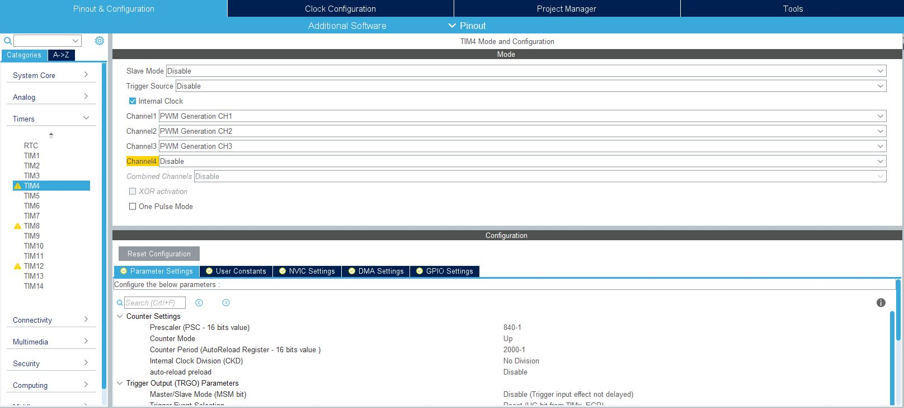

# STM32 PWM and Servo Tutorial STM32CubeIDE by Henry Silva

## Setup

The Adafruit Feather STM32F405RGT6 Express is used for this tutorial, but this should work for most other STM32 microcontrollers.
The board has two external resonators that will be used as the High Speed External Clock (HSE) and Low Speed External Clock (LSE) that are set under System Core int the RCC Mode and Configuration Menu.
In the Clock Configuration Tab, the HCLK has been set to 168 MHz, which is the max value.
HCLK can be whatever value, but it will have an effect on the frequency of your timers in the next step.

## Timer Setup and Configuration

The next step is to pick your timer that you would like to use for PWM.
The STM43F405 has 14 timers, but not all of them can do PWM.
To find out which timers that can be used, look at the reference manual for your device under the timers section.

For the STM32F4, timers 2 to 5 are general purpose timers capable of PWM.
Timer 4 will be used for this tutorial since it its pin is output on the Adafruit feather board.

To enable timer 4, look under the Timers section and click on TIM4.
Each timer may have multiple channels on different pins.
Timer 4 has 4 channels, enable the channels on the pins you would like to use for PWM output.
Also click the box next to **Inernal Clock** so that the timer uses the internal clock. **THIS IS VERY IMPORTANT**
Leave the other options and channels that you do not want to use disabled.

The next step is to set the presacler and counter period for the timer to get the PWM frequency that you want.
In this example, a servo will be controlled using PWM.
A servo needs a frequency of 50 Hz for input.
The frequency of the PWM signal is determined by the equation:

`PWM frequency = (Timer Clock Frequency) / ((Prescaler + 1) * (Counter Period + 1))`

To find the Timer Clock Frequency, you must first found out what source the timer is using.
This can be found by looking up the clock tree of your device.

Looking at the clock tree for the STM32F4, timer 4 is on the APB1 bus.
Look at your Clock Configuration to see what frequency your timer is on.

Notice that there are two different frequencies, the APB1 peripheral clocks and the APB1 Timer clocks.
The value that will be used in the equation (and the frequency that your clock is on) is in the AP1 Timer clocks box because it is a timer.
